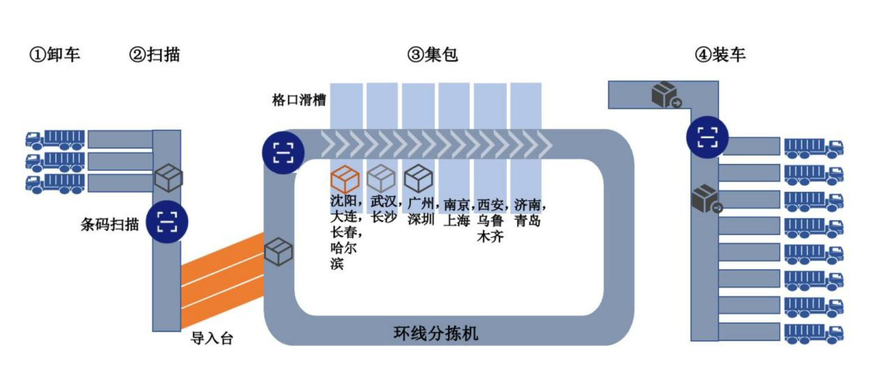
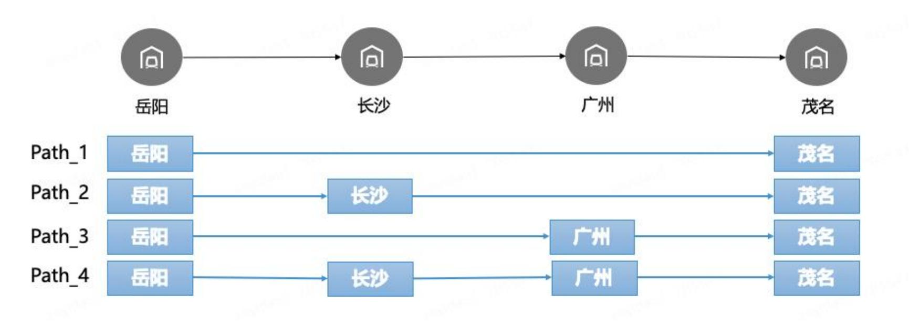

**2** **0** **2** **6** **年** **第** **六** **届** **长** **三** **角** **高** **校** **数** **学** **建** **模** **竞** **赛**

**赛题** **A：物流网络集包规则及设备优化**

目前物流公司通过一张大型物流网络完成整体需求的履约，通过线路连接各个分拣中心和终端站点，一个包裹往往需要经历多次分拣中心的中转，才能送达客户手中。包裹进入物流网络后，会生成一条走货路由，规定该包裹如何从出发地，经历多个场地，送达到客户手中。这条走货路由，对于每一个首分拣到末分拣到流向，是唯一确定的。其中分拣中心作为中间的中转环节，包裹需要经历卸车、扫描、集包、装车过程，最终把货物发送到下一流向中。

图 1：分拣操作示意图

这里集包操作，是对体积较小的包裹（小件）的操作：将相似走货路由的小件放到集包袋中，集中发运。在物流网络中，不同包裹会在一个分拣中心被放到集包袋中，共同经历一段运输后，在另一个场地分离。一个小件包裹在走货路由中需要建包操作的分拣中心顺序称为建包路径（如图2 所示），如果中间需要重新将已经集好的集包袋中的包裹重新组合，就需要进行拆包和重新建包操作。确定建包路径是个复杂的决策过程：极端情况下，如果所有包裹只在首分拣建包、末分拣拆包，会导致同一个集包袋中的包裹很少，会占用分拣格 口；另一个极端下，如果包裹在每个分拣都反复进行拆包、建包操作，则会占用分拣机的能力。这个问题被称作集包优化问题，即在一个给定的物流网络中，在包裹走货路由下考虑分拣中心产能和设备使用规则，为每个包裹流向选择建包路径，使得全网集

包成本最低。

图 2：集包路径示意图

在确定集包路径的过程中，首先需要保证唯一性，在每条首-末分拣流向中的唯一走货路由下，生成的建包路径需要是唯一的，即对于相同的首-末分拣流向中的包裹，其建包、拆包场地是一致的。同时，在每个分拣中心的集包过程中，会面对发往多个下一分拣的包裹，可能会将多个下一分拣流向的包裹合并在一起，我们称之为“混包 ”。考虑到分拣操作的可行性，我们需保证相同下一分拣流向的包裹在同一个集包中，不应将相同下一分拣流向的包裹分装在不同的集包中。对于形成混包， 目的地相同的小件包裹下一个拆包场地必须一致。

场地集包资源也是重要的约束，集包方式分为人工和机器两种。人工集包受到最大集包流向数限制，即分拣中心所有处理的人工建包流向数不超过某一阈值；机器集包受到分拣设备的格口数量限制，若场地 i 每个格口最多可处理ai 个包裹，则处理一个包裹量为 x 的流向需要占用 x 个格 口，其中r   l代表向上取整数。另

外，人工集包和机器集包的成本是不一致的，集包规则需要最小化总集包成本，即人工建包总成本和机器集包总成本之和。

当前物流网络有92 个分拣中心，需要对该网络确定各个流向的集包规则。对于该物流网络的每个首-末分拣流向，对应的走货路由如附件表 1 所示。货量是集包规则的重要输入，我们首先需要对该网络中首-末分拣流向未来的货量进行预测，附件表2 是该物流网络历史6 个月首-末分拣中心流向的货量。在确定集包规则过程中，需要输入每个分拣中心的机器和人工集包成本和产能（一天可处理的包裹量上限），如附件表3 所示。基于上数据，请回答以下问题：

**问题** **1** 建立货量预测模型，根据附件表2 的数据预测每个首-末分拣流向未来 7 天的小件包裹量，请将预测结果写入结果表 1 中。

**问题** **2** 根据问题 1 输出的结果，确定该物流网络的集包规则，结果需包含每个分拣中心需要集包的流向，请将优化结果写入结果表2 中。

**问题3** 供应商提供了如下几种设备可以购买，设备的信息（包含格口数量，设备产能限制，折旧年限，成本）如附件表4 所示。假设货量每年增长20%，请决策出如果要使未来 1 年网络总成本最低，每个场地应该投入的设备类型和数量，以及对应的最优集包规则（假设这期间集包规则不发生变化），并将决策优化得到的设备购置情况、集包规则写入结果表3 中。注：当设备产能不足时，可进行人工集包，每人每天最多可以处理5 个格 口，每人每天工资90 元。

参考资料：

【1】智能供应链:预测算法理论与实战，庄晓天等，电子工业出版社，2023.10

【2】Spyros Makridakis, M5 accuracy competition: Results, findings, and conclusions, International Journal of Forecasting, 2022.10

【3】智能供应链:运筹优化理论与实战，庄晓天等，电子工业出版社，2024.10

【4】智能供应链:数据科学理论与实战，庄晓天等，电子工业出版社，2025.8
